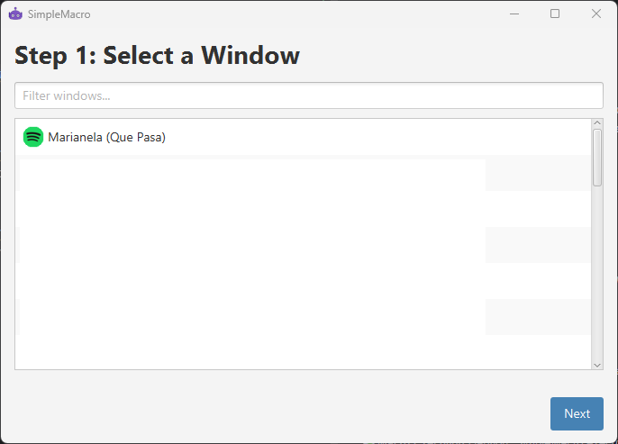
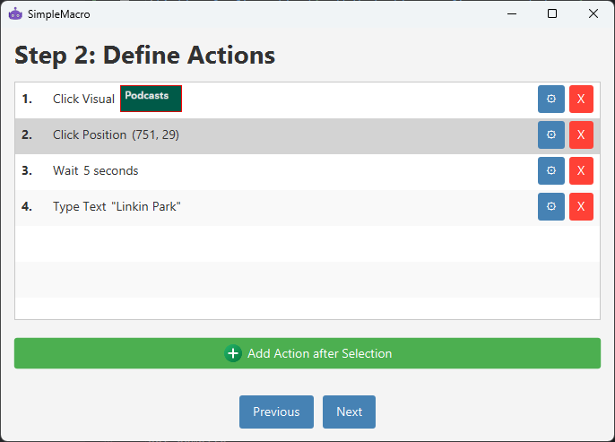
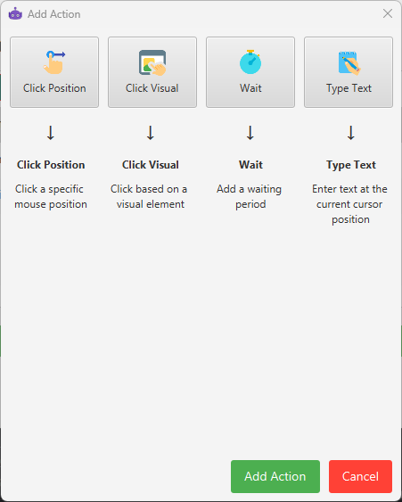
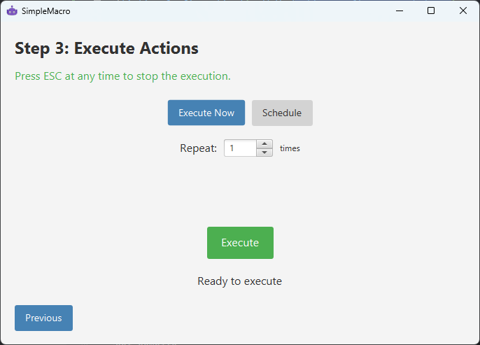

# SimpleMacro

SimpleMacro is a Java-based project that utilizes computer vision and native interface libraries to create a macro automation tool.

## Version
0.1.0-SNAPSHOT

## Project Overview
SimpleMacro is designed to provide macro functionality using computer vision techniques. It leverages OpenCV for image processing and JNA for native system interactions.

## Screenshots

### Main Window
 
*Caption: The main window of SimpleMacro showing the window selection step.*

### Action Configuration
 
*Caption: Configuring a macro action in SimpleMacro.*

### Add Action Pane
 
*Caption: The Add Action pane in SimpleMacro, where users can configure new macro actions.*

### Macro Execution
 
*Caption: SimpleMacro executing a configured macro.*

## Prerequisites
- Java Development Kit (JDK) 11 or higher
- Scala 2.13.16
- SBT (Scala Build Tool)

## Dependencies
- JNA (Java Native Access)
- JNA Platform
- SLF4J Simple
- OpenCV
- Config
- JavaFX (platform-specific modules)

## Building the Project
To build the project, use the following SBT command:
sbt compile

## Running the Project
To run the project, use the following SBT command:
sbt run

Note: The project is configured to run in a separate JVM.

## JavaFX Configuration
JavaFX modules are dynamically added based on the platform. The necessary modules and their paths are configured in the build file.

## Contributing
Contributions to SimpleMacro are welcome. Please ensure to follow the existing code style and add unit tests for any new features.
