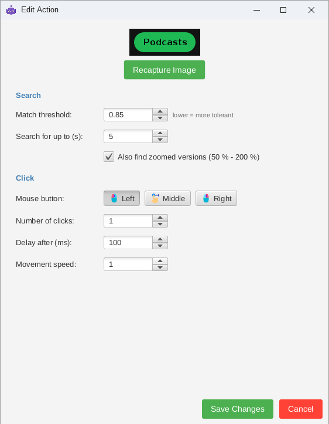

# SimpleMacro

SimpleMacro automates clicks, typing and keyboard shortcuts in a Windows application. It finds buttons by
position or by their appearance (computer vision with OpenCV) and runs your macro immediately or on a schedule.

## Download

**[Download SimpleMacro for Windows](https://github.com/its-leo/SimpleMacro/releases/latest/download/SimpleMacro-windows.zip)**
– extract the zip and start `SimpleMacro\SimpleMacro.exe`. No installation and no Java required.

All versions are listed on the [releases page](https://github.com/its-leo/SimpleMacro/releases).

## Screenshots

### Step 1: Select a Window
<br>
*Choose the window the macro runs in. The list refreshes automatically and can be filtered.*

### Step 2: Define Actions
<br>
*Add, edit, duplicate and reorder actions (drag a row by its ☰ handle). Macros can be saved and opened.*

### Add Action
<br>
*Eight action types are available.*

### Configure an Action
<br>
*A "Click Visual" action: the captured image, how it is searched for and how it is clicked.*

### Step 3: Execute
<br>
*Run the macro now or on a schedule. The log shows every executed action.*

## Actions

| Action | Description |
| --- | --- |
| **Click Position** | Clicks a recorded position relative to the window. The window is resized to the size it had when the position was recorded. |
| **Click Visual** | Clicks on a captured image. The window is searched for up to the configured time (e.g. while a page is still loading). Optionally also finds zoomed versions (50 % – 200 %). |
| **Wait** | Pauses for the configured time. |
| **Type Text** | Letters, digits, spaces and line breaks are typed key by key; other characters (symbols, umlauts, emoji, ...) are pasted via the clipboard, so they work with any keyboard layout. |
| **Key Combination** | Presses keys like `Enter`, `Ctrl+S` or `Alt+F4`. |
| **Scroll** | Scrolls up or down, optionally at a recorded position. |
| **Drag & Drop** | Drags from one position to another, e.g. for sliders or moving items. |
| **Wait for Image** | Waits until an image appears or disappears; the macro stops with an error after the timeout. |

All clicks support the left, middle and right mouse button, multiple clicks (e.g. double click), a delay after
the click and the speed of the human-like mouse movement.

Press **ESC** at any time (even when another window has the focus) or click **Stop** to stop a running or
scheduled macro. If an image cannot be found or the window was closed, the macro stops and the reason is shown.

## Saving macros

Use **Save** / **Open...** in step 2 to store macros as `.smacro` files (JSON with embedded images). The current
macro is also saved automatically and restored when SimpleMacro starts again.

## Display scaling and multiple monitors

All positions are recorded in physical screen pixels, so macros work with display scaling (e.g. 125 % or 150 %)
and on every monitor. Positions are relative to the selected window, so the window may be moved between recording
and execution.

## Development

Prerequisites: JDK 17 or higher and [sbt](https://www.scala-sbt.org/). Scala and all libraries are downloaded by sbt.

| Command | |
| --- | --- |
| `sbt run` | Start SimpleMacro (Windows only) |
| `sbt test` | Run the unit tests (any platform) |
| `sbt assembly` | Build a single executable jar `target/scala-2.13/SimpleMacro.jar` |

The Windows zip is built by the [Windows Package workflow](.github/workflows/package.yml) with `jpackage`: for pull
requests it is attached to the workflow run, for pushes to `main` it is published as release `v<version>` (the version
is taken from `build.sbt`).

The screenshots are created from the real UI with a simulated desktop (Linux with Xvfb):

```
xvfb-run -s "-screen 0 1920x1080x24" sbt "Test/runMain ui.ScreenshotTool"
```

### Project structure

| Package | Content |
| --- | --- |
| `model` | Action types and the `.smacro` file format |
| `engine` | Macro execution, scheduling, logging and keyboard/mouse helpers, independent of Windows and the UI |
| `cv` | Image search with OpenCV |
| `win` | Windows implementation (windows, mouse, keyboard, screen capture) |
| `ui` | JavaFX/ScalaFX user interface |

## Dependencies
- ScalaFX / JavaFX
- OpenCV
- JNA (Java Native Access)
- JNativeHook (global ESC hotkey)
- uJson
- SLF4J Simple

## Contributing
Contributions to SimpleMacro are welcome. Please follow the existing code style and add unit tests for new features.
