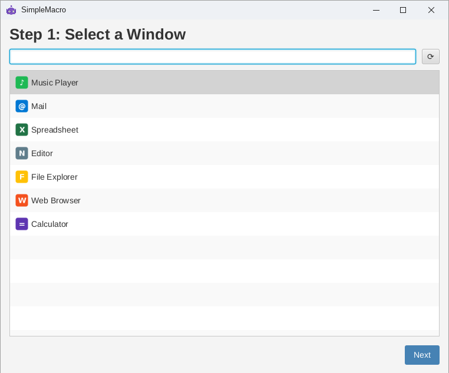
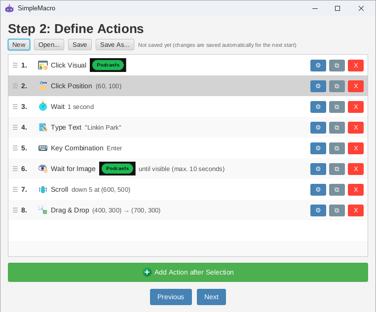
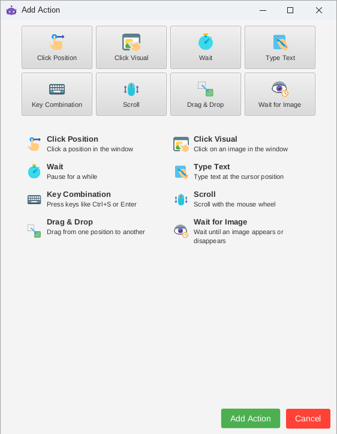
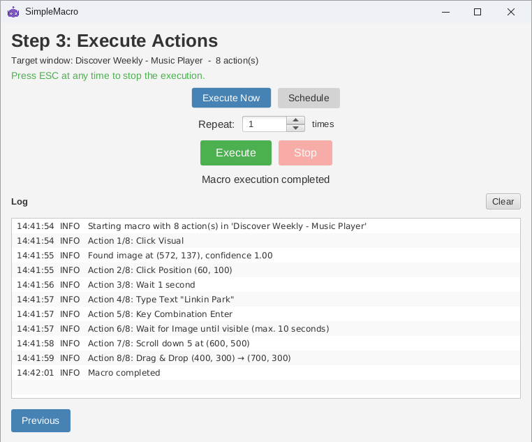

# SimpleMacro

SimpleMacro is a Scala/JavaFX desktop tool for Windows that uses computer vision and native interface libraries to automate clicks and typing in a selected window.

## Version
0.1.0-SNAPSHOT

## Project Overview
SimpleMacro is designed to provide macro functionality using computer vision techniques. It leverages OpenCV for image processing and JNA for native system interactions.

## Screenshots

### Main Window
<br>
*Caption: The main window of SimpleMacro showing the window selection step.*

### Action Configuration
<br>
*Caption: Configuring a macro action in SimpleMacro.*

### Add Action Pane
<br>
*Caption: The Add Action pane in SimpleMacro, where users can configure new macro actions.*

### Macro Execution
<br>
*Caption: SimpleMacro executing a configured macro.*

## Usage
1. **Select a window** – the macro is executed in this window. The list refreshes automatically and can be filtered.
2. **Define actions**
   - *Click Position*: clicks a recorded position relative to the window. The window is resized to the size it had when the position was recorded.
   - *Click Visual*: clicks on a captured image. SimpleMacro searches the window for up to 5 seconds (e.g. while a page is still loading) and stops the macro if the image cannot be found.
   - *Wait*: pauses for the configured time.
   - *Type Text*: letters, digits and spaces are typed key by key; other characters (symbols, umlauts, emoji, ...) are pasted via the clipboard, so they work with any keyboard layout. The previous clipboard text is restored afterwards.
3. **Execute** – run the macro now (optionally repeated) or schedule it to start at a given time and repeat every N seconds/minutes/hours.

Press **ESC** at any time (globally, even when another window is focused) or the **Stop** button to stop a running or scheduled macro.

## Prerequisites
- Windows (window handling uses the Win32 API)
- Java Development Kit (JDK) 17 or higher
- SBT (Scala Build Tool); Scala 2.13 is fetched automatically

## Dependencies
- JNA (Java Native Access)
- JNA Platform
- JNativeHook (global ESC hotkey)
- SLF4J Simple
- OpenCV
- ScalaFX / JavaFX (platform-specific modules)

## Building the Project
```
sbt compile
```

## Running the Tests
```
sbt test
```

## Running the Project
```
sbt run
```

Note: The project is configured to run in a separate JVM.

## JavaFX Configuration
JavaFX modules are dynamically added based on the platform. The necessary modules are configured in `build.sbt`.

## Contributing
Contributions to SimpleMacro are welcome. Please ensure to follow the existing code style and add unit tests for any new features.
